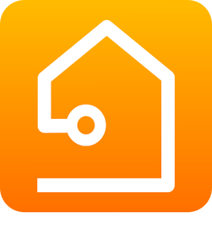
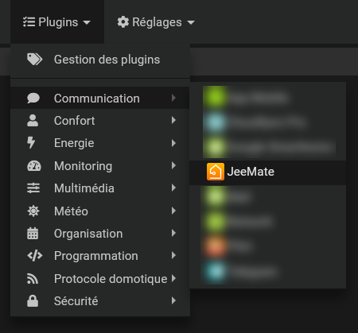
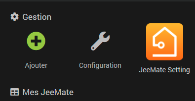

Plugin officiel de l'application JeeMate sur Android.
Et dans le Futur sur Android TV et IOS

Ce plugin permet d'appairer JeeMate avec votre serveur JeeMate, très facilement en seulement quelques clics. afin de créer un équipement virtuel qui vous permettra, via l'application, d'envoyer et recevoir des notifications,  et déclencher des événements basés sur la géolocalisation de votre appareil.

Présentation de l'application
==============================

JeeMate est une application mobile compatible avec Jeedom. Contrôlez facilement votre maison intelligente grâce à son interface intuitive et customisable. JeeMate dispose de nombreuses fonctionnalités, et est compatible avec de nombreux plugins Jeedom. JeeMate utilise les types génériques de Jeedom.

Sentez-vous toujours proche de chez vous!
Depuis n'importe où, vous pourrez:
- Interagir avec votre maison intelligente
- Monitorer et contrôler vos équipements
- Recevoir et répondre aux notifications PUSH, textes, images et/ou vocales.
- Automatiser des actions en fonction de votre localisation
- Visualiser vos caméras, ou streams externes en Live
- Visualiser l'historique de vos équipements si préalablement activés dans Jeedom

Grâce à son interface customisable, vous pourrez aussi:
- Définir des équipements et scènes favoris
- Filtrer l'affichage dans vos Favoris et Pièces, par type
- Réorganiser l'ordre d'affichage
- Customiser vos widgets
- Customiser l'affichage globale ou par Pièces
- Sécuriser l'accès à chaque équipements! Grâce à un digicode ou la reconnaissance biométrique (faciale ou empreinte digitale)
- Afficher vos designs Jeedom et autres pages favorites, comme des pages persos grafana ou autres!
- Et même créer des scénarios grâce à son éditeur!

Note: L'utilisation continue du GPS en tâche de fond peut réduire la durée de vie de la batterie. JeeMate contient des paramètres afin d'optimiser ceci (cf doc ci-dessous)

JeeMate est une application Freemium. Il est ainsi possible d'utiliser de nombreuses fonctions de base gratuitement. Il est possible d'acheter la version Premium et de supporter son développement, afin de bénéficier de toutes les fonctionnalités.

Fonctionnalités
==============================

Découvrez ci-dessous toutes les différences entre les versions Free et Premium.

(Liste non representative de la lise final)

| JeeMate                                  | Free     | Premium  |
| ---------------------------------------- | -------- | -------- |
| Nombre d'équipements connectés en simultané | Illimité | Illimité |
| Service de géolocalisation               | Oui      | Oui      |
| Tri des objets et des équipements        | Oui      | Oui      |
| Envoi de notifications PUSH              | Oui      | Oui      |
| Récupération de l'état des équipements   | Oui      | Oui      |
| Contrôle des équipements ON/OFF          | Oui      | Oui      |
| Contrôle des équipements avec variateur  | Oui      | Oui      |
| Création de favoris                      | Oui      | Oui      |
| Recherche d'équipements                  | Oui      | Oui      |
| Service de GeoFencing                    | Non      | Oui      |
| Service de Camera ML                     | Non      | Oui      |
| Service de géolocalisation               | Non      | Oui      |
| Service de Reconnaissance Vocal          | Non      | Oui      |
| Service d'envoi de SMS                   | Non      | Oui      |
| Service SIP                              | Non      | Oui      |
| Création de Group                        | Non      | Oui      |
| Onglet Pièces                            | Non      | Oui      |
| Onglet Cameras                           | Non      | Oui      |
| (FUTUR) Widget : Favoris                 | Non      | Oui      |
| (FUTUR) Widget : Scénarios               | Non      | Oui      |
| Serveurs max paramétrés en simultané     | 1        | Illimité |
| Soutien pour les développements futurs   | Non      | Oui ! <3 |

Compatibilité avec Jeedom
==============================

JeeMate gère certains plugins Jeedom Officiels, ainsi que d'autres développés par la communauté.

JeeMate gère les types génériques définis dans JEEDOM et plus!
Si un équipement n'est pas associé à un type générique, alors il ne sera pas visible.
[Plus d'informations sur les types génériques.](https://www.jeedom.com/blog/3327-application-mobile-les-types-generiques/)

Compatibilité avec les plugins Jeedom
==============================

| Nom du plugin | Compatible ?                      |
| ------------- | --------------------------------- |
| Alarme        | Oui                               |
| AndroidRc     | Télécommandes                     |
| Caméra        | Oui                               |
| FreeboxTelec  | Oui                               |
| Géoloc        | Oui                               |
| JeeOrangeTv   | Télécommande                      |
| JeeMySensors  | En cours                          |
| JeeRhasspy    | Oui/Intents                       |
| JMQTT         | Oui                               |
| Mode          | Oui                               |
| Thermostat    | Oui                               |
| Virtuel       | Oui                               |
| Weather       | Oui                               |
| Pronote       | Futur                             |
| Suivi Conso   | Futur                             |

Tableau des compatibilités
==============================

#### Chauffage

| Type générique                  | Sous-type | Compatible ? |
| ------------------------------- | --------- | ------------ |
| Chauffage fil pilote Etat       | Info      | Oui          |
| Chauffage fil pilote Bouton     | Action    | Non          |
| Chauffage fil pilote Bouton OFF | Action    | Oui          |
| Chauffage fil pilote Bouton ON  | Action    | Oui          |

#### Généric

| Type générique                        | Sous-type | Compatible ? |
| ------------------------------------- | --------- | ------------ |
| Tous                                  | Info      | Oui          |

#### Lumière

| Type générique     | Sous-type | Compatible ? |
| ------------------ | --------- | ------------ |
| Lumière couleur    | Info      | Oui          |
| Lumière Etat       | Info      | Oui          |
| Lumière Bouton Off | Action    | Oui          |
| Lumière Bouton On  | Action    | Oui          |
| Lumière Couleur    | Action    | Non          |
| Lumière Mode       | Action    | Non          |
| Lumière Slider     | Action    | Oui          |
| Lumière Toggle     | Action    | Oui          |

#### Mode

| Type générique | Sous-type | Compatible ? |
| -------------- | --------- | ------------ |
| Mode Info      | Info      | Non garanti  |
| Mode Action    | Action    | Non garanti  |

#### Portail/Garage

| Type générique                  | Sous-type | Compatible ? |
| ------------------------------- | --------- | ------------ |
| Garage état ouvrant             | Info      | Oui          |
| Portail état ouvrant            | Info      | Oui          |
| Portail ou garage bouton toggle | Action    | Oui          |

#### Prise

| Type générique   | Sous-type | Compatible ? |
| ---------------- | --------- | ------------ |
| Prise Etat       | Info      | Oui          |
| Prise Bouton Off | Action    | Oui          |
| Prise Bouton On  | Action    | Oui          |
| Prise Slider     | Action    | Oui          |

#### Serrure

| Type générique        | Sous-type | Compatible ? |
| --------------------- | --------- | ------------ |
| Serrure Etat          | Info      | Oui          |
| Serrure Bouton Fermer | Action    | Oui          |
| Serrure Bouton Ouvrir | Action    | Oui          |

#### Sirène

| Type générique    | Sous-type | Compatible ? |
| ----------------- | --------- | ------------ |
| Sirène Etat       | Info      | Oui          |
| Sirène Bouton Off | Action    | Oui          |
| Sirène Bouton On  | Action    | Oui          |

#### Thermostat

| Type générique                  | Sous-type | Compatible ? |
| ------------------------------- | --------- | ------------ |
| Thermostat Température ambiante | Info      | Oui          |
| Thermostat Humidité ambiante    | Info      | Oui          |
| Thermostat Mode                 | Info      | Oui          |
| Thermostat consigne             | Action    | Oui          |
| Thermostat Mode                 | Action    | Oui          |

#### Volet

| Type générique         | Sous-type | Compatible ? |
| ---------------------- | --------- | ------------ |
| Volet BSO Etat         | Info      | Oui          |
| Volet Etat             | Info      | Oui          |
| Volet BSO Bouton Down  | Action    | Oui          |
| Volet BSO Bouton Up    | Action    | Oui          |
| Volet Bouton Descendre | Action    | Oui          |
| Volet Bouton Monter    | Action    | Oui          |
| Volet Bouton Slider    | Action    | Oui          |
| Volet Bouton Stop      | Action    | Oui          |

#### Caméra

| Type générique                  | Sous-type | Compatible ? |
| ------------------------------- | --------- | ------------ |
| Etat                            | Info      | Oui          |
| Mouvement caméra vers le bas    | Action    | Non          |
| Mouvement caméra vers la droite | Action    | Non          |
| Mouvement caméra vers la gauche | Action    | Non          |
| Mouvement caméra vers le haut   | Action    | Non          |
| Preset caméra                   | Action    | Non          |
| Stop caméra                     | Action    | Non          |
| Zoom caméra vers l'arrière      | Action    | Non          |
| Zoom caméra vers l'avant        | Action    | Non          |

Configuration du plugin JeeMate
==============================

Après téléchargement du plugin, vous devez commencer par l'activer.

Ensuite, vous devez **créer un équipement**. Pour cela :

1. Accéder à la page "Plugins > Communication > JeeMate"

2. Cliquer sur "Ajouter" pour créer votre premier appareil
   

3. Entrer un nom pour votre équipement, puis cliquer sur "D'accord"

4. Par défaut, l'équipement est automatiquement activé avec la configuration adéquate :
   
   - Activé : par défaut, afin de vous épargner un clic
   - Clé API : il est préferrable de laisser la valeur par défaut. Ne modifiez cette valeur que si vous souhaitez recevoir des notifications sur votre iPhone depuis 2 serveurs jeedom. Voir section "Réception des notifications depuis 2 serveurs JEEDOM"
   - Utilisateur : permet de définir quel utilisateur se connecte à l'application
   - QRCode : le QR code qui s'affiche à la droite de la fenêtre vous permettra de configurer l'application sur votre téléphone ou tablette.

   Une fois ces étapes réalisées, vous pouvez lancer l'application JeeMate sur votre appareil.

Premier lancement de l'app JeeMate
==============================

Si ce n'est pas déjà fait, [téléchargez l'application sur votre téléphone ou tablette](https://play.google.com/store/apps?hl=fr). 
Puis :

1. Suivez les étapes proposées dans l'assistant si elles n'ont pas déjà été faites précédemment
2. Scanner le QR code présent sur l'équipement créé sur Jeedom.
3. Finaliser la création du serveur, et voilà !

Fonctionnalités 
==============================

JeeMate a été conçu pour être facile à utiliser

JeeMate est décomposé en quatre onglets:
- Favoris Maison
- Pièces
- Caméras
- Designs Jeedom et pages web favorites

Pour naviguer entre les onglets, il est possible soit de cliquer sur les boutons dans la barre en bas de l'application, ou alors de faire un swipe gauche/droite sur l'écran

Lorsque vous cliquez sur les boutons Pièces, ainsi que Designs, une liste apparaitra afin de sélectionner la Pièce ou le Design que vous souhaitez afficher

#### Onglets Favoris Maison

L'écran principal contient les sections suivantes :
- Barre d'outil tout haut. Permet d'accéder au menu de JeeMate, à la reconnaissance vocale ainsi qu'aux notifications.
- Résumé global Jeedom (dépend de la configuration des résumés dans Jeedom)
- Widgets Spéciaux liés à certains plugins Jeedom (Météo, Télécommandes, Thermostat, Alarme, Volets, Modes)
- Scénarios favoris
- Equipements et applications Android favoris

Les plugins sont automatiquempent paramétrés lors de la synchronisation de l'interface.

Pour ajouter un favoris (Equipements ou Scénarios), cliquer sur le bouton "+" correspondant à la section, sur la gauche de l'écran
Pour filter, les favoris par type d'équipement, cliquer sur l'icone "Filtre", sur la droite de l'écran

Contrôle d'un équipement

- Pour contrôler un équipement ou lancer un scénario, il suffit de faire un clic sur l'élément.
Pour un équipement simple, comme par exemple ON/OFF, l'action sera immédiatement envoyée.
Pour un équipement contenant plusieurs commandes, ou historiques, cela affichera une page avec des contrôles complémentaires.

- Pour afficher, le menu de réglages Customisation Tile, double cliquer sur l'équipement. Vous pourrez ainsi choisir de la verrouiller, ainsi que changer son widget.

- Pour réorganiser l'ordre d'affichage, appuyer quelques secondes sur l'équipement et déplacer la tile à l'endroit souhaité.

En fonction de l'équipement, plusieurs pages différentes peuvent apparaitre :

* Allumer
* Éteindre
* Lumières (Intensité, couleur)
* Thermostats
* Volets
* Etc.

#### Onglet Pièces 
L'écran contient trois sections:
- Scénarios
- Equipements
- Caméras

Il est possible de customiser l'affichage pour chaque pièces en cliquer sur l'icone d'édition en haut à droite dans la barre d'outils JeeMate
Il sera alors possible de :
- Renommer la pièce
- Choisir une image de fond
- Choisir une couleur de fond
- Utiliser le thème par défaut
Ainsi que de paramétrer certains paramètres pour vos équipements, comme:
- rendre visible ou non
- ajouter aux Favoris Maison
- sécuriser par digicode ou reconnaissance biométrique

#### Onglet Caméras
Cliquer sur le bouton "+" pour ajouter une caméra puis :
- saisir un nom
- et son url

La caméra apparaitra alors dans JeeMate. Vous pourrez ensuite rééditer ses paramètres, ou bien la supprimer, en cliquant sur son icone "Roue crantée"

#### Designs Jeedom et pages web favorites
Cet onglet permet d'afficher des pages web. Telles que:
- Designs Jeedom
- Vos dashboards Grafana préférés
- etc

Pour cela, il suffit de cliquer sur le bouton Onglet "Design" dans la barre en bas, puis sur l'icone "Roue crantée":
- saisir un nom
- son url
- la fréquence de rafraichissement si besoin

Pour rééediter les paramètres, il suffit de cliquer sur le bouton Onglet "Design" dans la barre en bas, puis sur l'icone "Roue crantée", et de sélectionner dans la liste 

#### Menu JeeMate
Accessible depuis le bouton Menu, dans la barre d'outils JeeMate, en haut, il permet de :
- créer des scénarios
- configurer JeeMate

Nous allons tout d'abord explorer les paramètres de configuration JeeMate, puis la création de scénarios.

Configuration 
==============================
Le menu "Configuration" permet de paramétrer :
- les notifications avec TTS ou non
- la géolocalisation (Activer, Envoyer la position courante à Jeedom pour régler la position Maison dans le plugin Jeedom Géoloc Officiel, affiner les réglages pour le géofencing et la durée batterie)
- le lien JeeMate<->Jeedom. Ici rien a configurer. Mais ce menu permet de synchroniser JeeMate avec votre serveur Jeedom et de mettre à jour de nouveaux équipements. Il permet sinon, de réapparairer votre téléphone, ou bien de  remettre à zéro l'interface graphique
- Mini-RemoteServer (Activer ou non). Il s'agit d'une fonctionnalité qui permet depuis Jeedom de contrôler votre appareil JeeMate, comme Verrouiller l'écran, faire parler JeeMate, afficher des pages et widgets
- Sécurité (Activer ou non les biométriques, digicode etc). Afin d'empecher que quelqu'un d'autre n'utilise JeeMate.
- Thèmes&Langues. Entre autres, afficher une image en fond d'écran sur la page des Favoris, activer le thème jour/nuit, choisir les fonds d'écran pour chaque mode etc
- Sauver/Importer App. Permet de sauvegarder la configuration, les favoris, pièces etc de JeeMate dans votre serveur Jeedom. Importer permet donc de réimporter une sauvegarde.

Questions fréquentes
=
