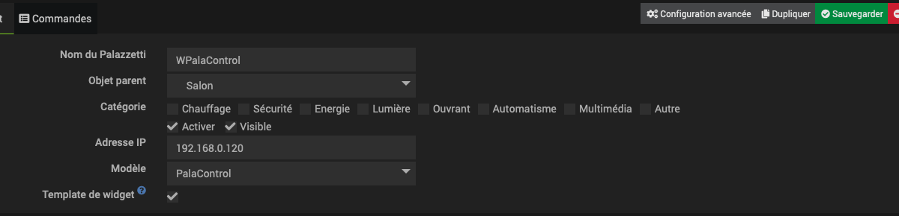
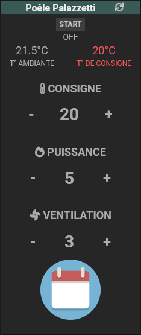
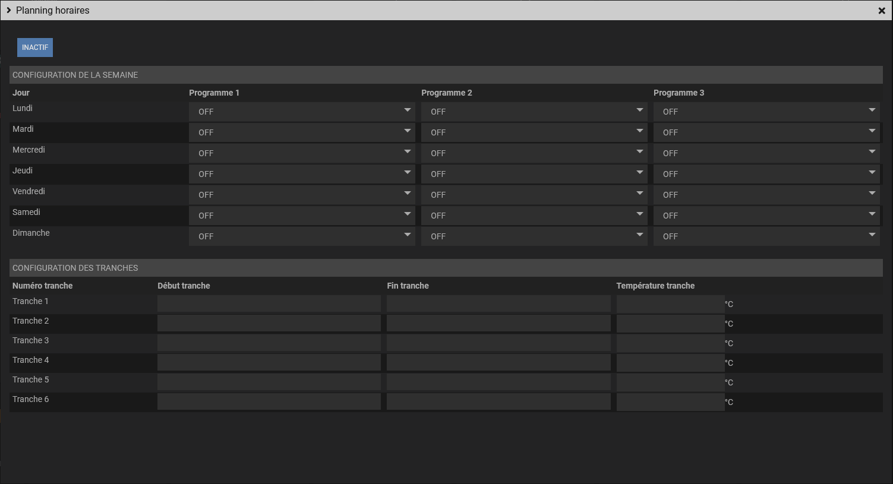

# Palazzetti

## 1 ) Description

Le plugin Palazzetti permet d'intégrer dans votre système domotique Jeedom les poêles à pellets de la marque Palazzetti au moyen de la passerelle Connection Box. 

Les fonctionnalités proposées par le plugin sont identiques à celles de l'application mobile officielle Palazzetti App. 

Un widget simple de pilotage est mis à disposition sur le dashboard, il permet: 

- d'allumer / éteindre le poêle 
- de modifier la consigne 
- de motifier la force de la ventilation 
- de modifier l'intensité du foyer 
- de gérer les programmes horaires selon la philosophie du poêle 
- de visualiser toutes les informations du poêle et de la Connection Box 

Pour la version mobile, le widget est épuré de l'accès à la configuration des programmes horaires et des informations du poêle.
 

## 2) Aperçu des interfacess : 

### Configuration du plugin :

### Ajout et configuration d'un équipement :

### Widget final : 

## 2) Compléments : 

### Modification de la configuration réseau de la Connection Box : 

La Connection Box est prévue initialement pour remplir un rôle de passerelle wifi entre l'application mobile et le poêle. 

Il est possible de modifier la configuration réseau de la CBox via son serveur web embarqué. 

Cette interface permet par exemple de désactiver le wifi et d'utiliser uniquement l'ethernet. 

Pour accéder à cette interface, connectez la CBox à votre réseau local, récupérez son adresse IP et consultez via un navigateur web cette adresse IP (par exemple http://192.168.1.10). 

## 3) Astuces

## Faq
