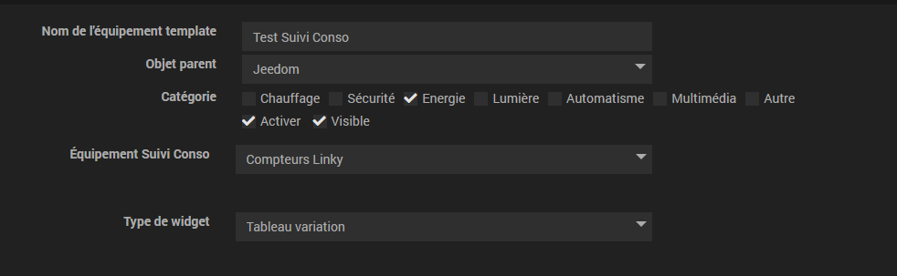
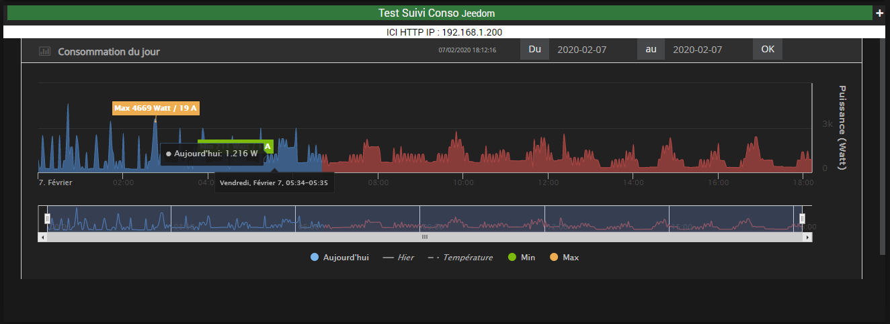
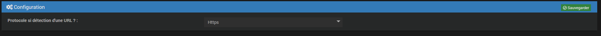

# Suivi Conso Widget

## Présentation

Le plugin Conso Widget permet d'afficher les graphiques de Suivi Conso dans le Dashboard ainsi que dans les designs.

Page de Configuration : 

Exemple de graphique :

## Configuration : 

La configuration du plugin est extrêmement simple, vous n'avez qu'une seule chose a faire, Il vous suffit de choisir dans la page de configuration si votre acces externe est en https ou en http.

# Le plugin ne fonctionnera pas sans sa dependance principale qui est le plugin Suivi Conso lui même
