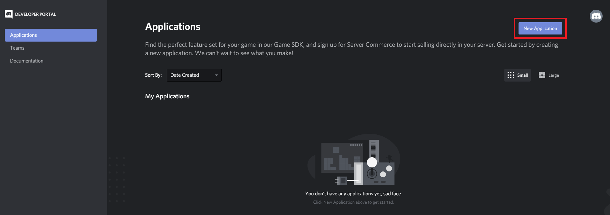
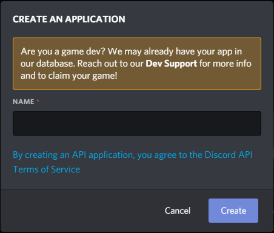
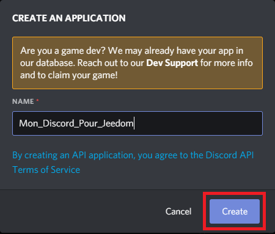
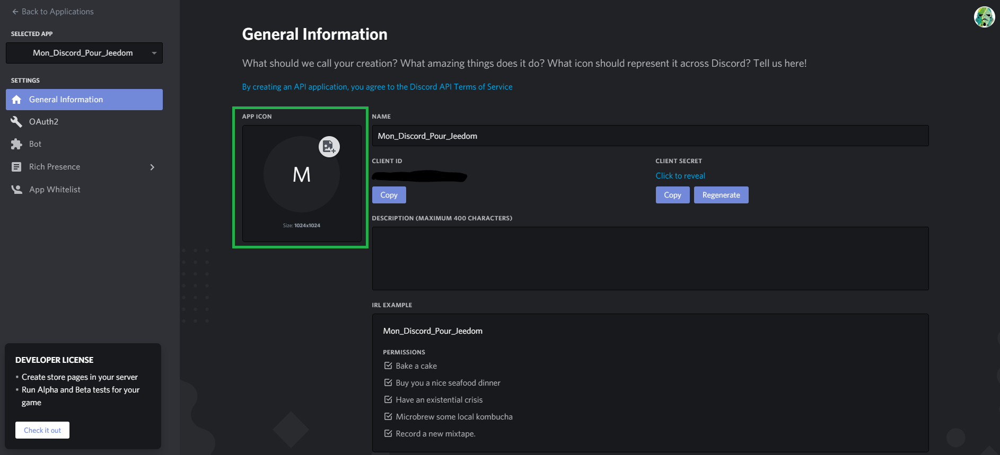
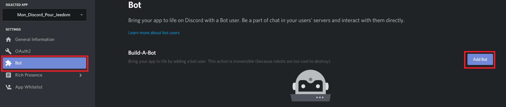
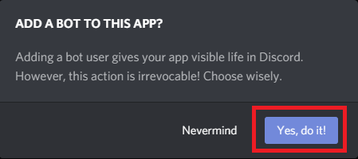
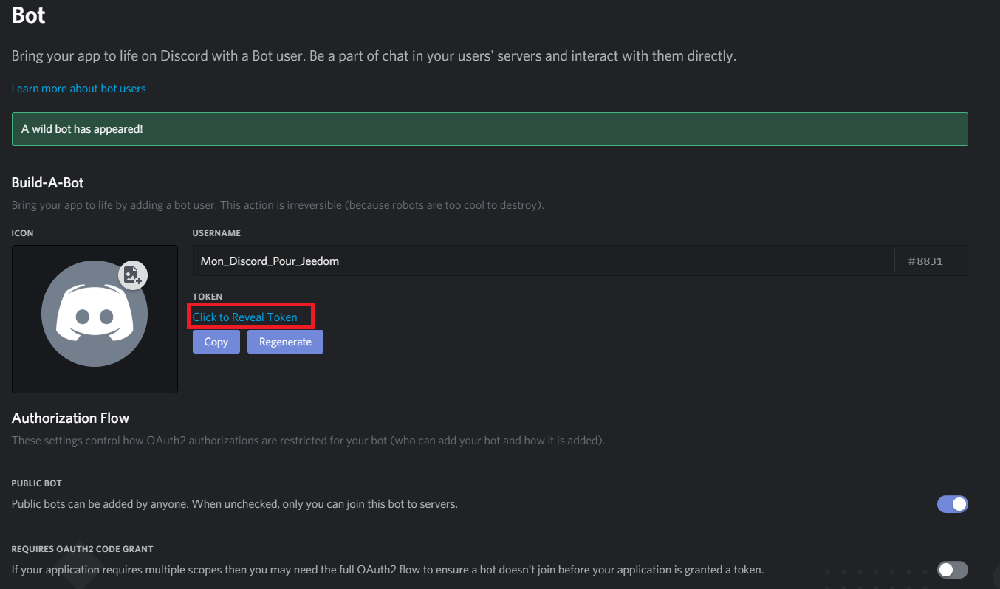
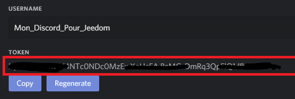

# Discord Link

## 1 ) Description

Le plugin Discord Link permet d'envoyer des message sur son serveur Discord : 
 - Messages Classiques
 - Messages Evolués
 - Messages TTS
 - Gestion des Chanels ( Salon )
 - Fonction ASK ( A venir )

Pour cela il faut avoir son serveur Discord.  

## 2 ) Paramètres obligatoires : 

### Son Serveur Discord :

**Création de son serveur :** 
Dans Discord menu de Gauche cliquez sur + pour créer votre Serveur Discord

**Récupération de son Token :** 
 - Allez sur le liens suivant: 
 [https://discordapp.com/developers/applications/](https://discordapp.com/developers/applications/)
 
 
 
 Cliquer sur "New Application"
  
 

Vous Obtenez cette fenêtre

 

Entrez le nom pour votre Bot et cliquez sur "Create"

 

Votre Bot est crée vous pouvez lui affecter un avatar

 

Cliquez sur le menu de gauche sur "Bot" et cliquez a droite sur "Add Bot"

 

Cliquez sur "Yes, do it!"

 

Voilà votre Bot est crée, Cliquez sur "Click to Reveal Token"

 

Copiez collez votre Token dans un bloc note, vous en aurez besoin plus loin.

## Configuration du Plugin
Après le téléchargement du plugin, il vous suffit de l’activer et de le configurer.
**Market :** 
