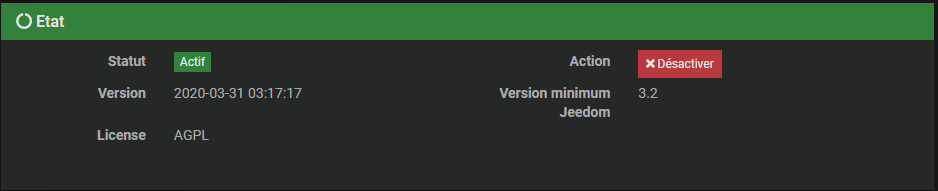
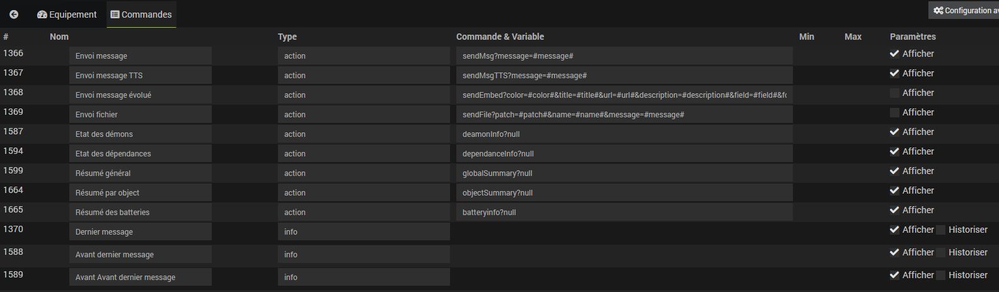

# Discord Link

## 1 ) Description

Le plugin Discord Link permet d'envoyer des message sur son serveur Discord : 
 - Messages Classiques
 - Messages Evolués
 - Messages TTS
 - Gestion des Chanels ( Salon )
 - Fonction ASK
 - Fonction Envoie Fichiers ( A venir )

Pour cela il faut avoir son serveur Discord.  

## 2 ) Paramètres obligatoires : 

### Son Serveur Discord :

**Création de son serveur :** 
Dans Discord menu de Gauche cliquez sur + pour créer votre Serveur Discord

**Récupération de son Token :** 
 - Allez sur le liens suivant: 
 [https://discordapp.com/developers/applications/](https://discordapp.com/developers/applications/)
 
 
 
 Cliquer sur "New Application"
  
 

Vous Obtenez cette fenêtre

 

Entrez le nom pour votre Bot et cliquez sur "Create"

 

Votre Bot est crée vous pouvez lui affecter un avatar

 

Cliquez sur le menu de gauche sur "Bot" et cliquez a droite sur "Add Bot"

 

Cliquez sur "Yes, do it!"

 

Voilà votre Bot est crée, Cliquez sur "Click to Reveal Token"

 

Copiez collez votre Token dans un bloc note, vous en aurez besoin plus loin.

## 3) Configuration du Plugin
Après le téléchargement du plugin, il vous suffit de l’activer et de le configurer.
 
Une fois activé, il faut le configurer.
**3.1) Dépendances** 
Cette partie permet de valider et d’installer les dépendances requises au bon fonctionnement du plugin Discord Link 
 
Cliquez sur "Relancer" et attendre la fin de l'installation des Dépendances.
Un Statut **OK** confirme que les dépendances sont satisfaites.
> **Tip**
> 
> La mise à jour des dépendances peut prendre plus de 20 minutes selon votre matériel. La progression est affichée en temps réel et un log **discordlink_dep** est accessible.

> **Important**
> 
> La mise à jour des dépendances est normalement à effectuer seulement si le Statut est **NOK**, mais il est toutefois possible, pour régler certains problèmes, d’être appelé à refaire l’installation des dépendances.

**3.1) Configuration** 

Cette partie permet de configurer les paramètres généraux du plugin

Entrez votre token précédemment mis de coté dans un bloc note et cliquez sur "Ajouter votre bot a votre serveur discord"
N’oubliez pas de  si vous effectuez une modification.

**3.2) Démon**

 Cette partie permet de valider l’état actuel du ou des démons et de configurer la gestion automatique de ceux-ci.
 
Le démon local et l’ensemble des démons déportés seront affichés avec leurs différentes informations

-   Le **Statut** indique que le démon est actuellement en fonction.
    
-   La **Configuration** indique si la configuration du démon est valide.
    
-   Le bouton **(Re)Démarrer** permet de forcer le redémarrage du plugin, en mode normal ou de le lancer une première fois.
    
-   Le bouton **Arrête**, visible seulement si la gestion automatique est désactivée, force l’arrêt du démon.
    
-   La **Gestion automatique** permet à Jeedom de lancer automatiquement le démon au démarrage de Jeedom, ainsi que de le relancer en cas de problème.
    
-   Le **Dernier lancement** est comme son nom l’indique la date du dernier lancement connue du demon.

**3.3) Log**

Cette partie permet de choisir le niveau de log ainsi que d’en consulter le contenu.
 
Sélectionner le niveau puis sauvegarder, le démon sera alors relancé avec les instructions et traces sélectionnées.

Le niveau **Debug** ou **Info** peuvent être utiles pour comprendre pourquoi le démon plante ou ne remonte pas une valeur.

> **Important**
> 
> En mode **Debug** le démon est très verbeux, il est recommandé d’utiliser ce mode seulement si vous devez diagnostiquer un problème particulier. Il n’est pas recommandé de laisser tourner le démon en **Debug** en permanence, si on utilise une **SD-Card**. Une fois le debug terminé, il ne faut pas oublier de retourner sur un niveau moins élevé comme le niveau **Error** qui ne remonte que d’éventuelles erreurs.

## 4) Configuration des équipements
La configuration des équipements Discord Link est accessible à partir du menu plugin :

 

Ci-dessous un exemple d’une page du plugin Discord Link (présentée avec quelques équipements) :

 

**4.1) Général**
Vous retrouvez ici toute la configuration de votre équipement :

 

-   **Nom du channels** : nom de votre Equipement.
    
-   **Objet parent** : indique l’objet parent auquel appartient l’équipement.
    
-   **Catégorie** : les catégories de l’équipement (il peut appartenir à plusieurs catégories).
    
-   **Activer** : permet de rendre votre équipement actif.
    
-   **Visible** : le rend visible sur le dashboard.
    
-   **Channel** : Liste des Salons présent sur votre Discord.

**4.2) Commandes**
Ci-dessous vous retrouvez la liste des commandes :

 

-   Send Embed Message ( Message évolué )
    
-   Send message ( Message simple )
    
-   Send message TTS ( Message lu par Discord )

Afficher : permet d’afficher la donnée sur le dashboard.

## 5) Utilisations dans un scénario

**5.1) Message Simples**
 
Résultat sur votre discord
 

**5.2) Message Embed**
 
Résultat sur votre discord
 

**5.3) Fonction ASK**
 
Résultat sur votre discord
 
il vous suffit de cliquer sur la réponse dans le carré rouge

## Faq
A venir
