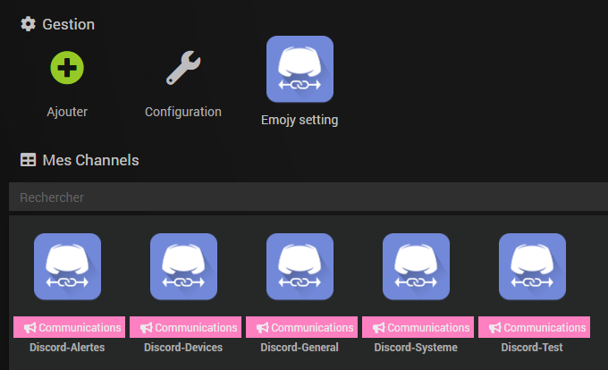

# Discord Link

## 1 ) Description

Le plugin Discord Link permet d'envoyer des messages sur son serveur Discord : 
 - Messages Classiques
 - Messages Evolués
 - Messages TTS
 - Gestion des Channels ( Salon )
 - Compatible avec les interactions de Jeedom
 - Fonction ASK
 - Fonction Envoi de Fichiers
 - Fonction Etat des Démons de Jeedom et des antenne Blea
 - Fonction Etat des Dépendances des plugins Jeedom
 - Fonction Etat du résumé global
 - Fonction Etat de résumé par Pièce / Objet
 - Fonction Etat des batteries
 - Fonction Etat des communications des modules Z-Wave
 - Fonction Envoi des états des démons, dépendances et Z-Wave si erreur
 - Personnalisation des Emojis pour les résumés et les messages

Pour cela, il faut avoir son serveur Discord.  

## 2 ) Paramètres obligatoires : 

### Son Serveur Discord :

**Création de son serveur :** 
Dans Discord, menu de Gauche, cliquez sur + pour créer votre Serveur Discord

**Récupération de son Token :** 
 - Allez sur le lien suivant: 
 [https://discordapp.com/developers/applications/](https://discordapp.com/developers/applications/)
 
 
 
 Cliquez sur "New Application"
  
 

Vous Obtenez cette fenêtre

 

Entrez le nom pour votre Bot et cliquez sur "Create"

 

Votre Bot est créé, vous pouvez lui affecter un avatar et n'oubliez pas de sauvegarder.

 

Cliquez sur le menu de gauche sur "Bot" et cliquez à droite sur "Add Bot"

 

Cliquez sur "Yes, do it!"

 

Voilà, votre Bot est créé, cliquez sur "Click to Reveal Token"

 

Copiez-collez votre Token dans un bloc-note, vous en aurez besoin plus loin.

## 3) Configuration du Plugin
Après le téléchargement du plugin, il vous suffit de l’activer et de le configurer.
 
Une fois activé, il faut le configurer.

**3.1) Dépendances** 

Cette partie permet de valider et d’installer les dépendances requises au bon fonctionnement du plugin Discord Link 
 
Cliquez sur "Relancer" et attendre la fin de l'installation des Dépendances.
Un Statut **OK** confirme que les dépendances sont satisfaites.
> **Tip**
> 
> La mise à jour des dépendances peut prendre plus de 20 minutes selon votre matériel. La progression est affichée en temps réel et un log **discordlink_dep** est accessible.

> **Important**
> 
> La mise à jour des dépendances est normalement à effectuer seulement si le Statut est **NOK**, mais il est toutefois possible, pour régler certains problèmes, d’être appelé à refaire l’installation des dépendances.

**3.2) Configuration** 

Cette partie permet de configurer les paramètres généraux du plugin

Entrez votre token précédemment mis de côté dans un bloc-note
Cliquez sur **"Ajouter votre bot à votre serveur Discord"**.

Vous pouvez personnaliser la phrase envoyée par votre Bot sur votre Serveur Joue à : .

N’oubliez pas de  si vous effectuez une modification.

**3.3) Démon**

 Cette partie permet de valider l’état actuel du ou des démons et de configurer la gestion automatique de ceux-ci.
 
Le démon local et l’ensemble des démons déportés seront affichés avec leurs différentes informations.

-   Le **Statut** indique que le démon est actuellement en fonction.
    
-   La **Configuration** indique si la configuration du démon est valide.
    
-   Le bouton **(Re)Démarrer** permet de forcer le redémarrage du plugin, en mode normal ou de le lancer une première fois.
    
-   Le bouton **Arrête**, visible seulement si la gestion automatique est désactivée, force l’arrêt du démon.
    
-   La **Gestion automatique** permet à Jeedom de lancer automatiquement le démon au démarrage de Jeedom, ainsi que de le relancer en cas de problème.
    
-   Le **Dernier lancement** est comme son nom l’indique la date du dernier lancement connu du démon.

**3.4) Log**

Cette partie permet de choisir le niveau de log ainsi que d’en consulter le contenu.
 
Sélectionnez le niveau puis sauvegardez, le démon sera alors relancé avec les instructions et traces sélectionnées.

Les niveaux **Debug** ou **Info** peuvent être utiles pour comprendre pourquoi le démon plante ou ne remonte pas une valeur.

> **Important**
> 
> En mode **Debug**, le démon est très verbeux, il est recommandé d’utiliser ce mode seulement si vous devez diagnostiquer un problème particulier. Il n’est pas recommandé de laisser tourner le démon en **Debug** en permanence si on utilise une **SD-Card**. Une fois le debug terminé, il ne faut pas oublier de retourner sur un niveau moins élevé comme le niveau **Error** qui ne remonte que d’éventuelles erreurs.

## 4) Configuration des équipements
La configuration des équipements Discord Link est accessible à partir du menu plugin :

 

Ci-dessous un exemple d’une page du plugin Discord Link (présentée avec quelques équipements) :

 

**4.1) Général**
Vous retrouvez ici toute la configuration de votre équipement :

 

-   **Nom du channel** : nom de votre équipement.
    
-   **Objet parent** : indique l’objet parent auquel appartient l’équipement.
    
-   **Catégorie** : les catégories de l’équipement (il peut appartenir à plusieurs catégories).
    
-   **Activer** : permet de rendre votre équipement actif.
    
-   **Visible** : le rend visible sur le dashboard.

-   **Interactions avec Jeedom** : Pour activer les interactions avec cet équipement 

-   **Daemon Check / Dependances Check / Z-Wave Check** : Permet d'activer la fonction envoi des états cochés si erreur détectée.
    
-   **Channels** : Liste des Salons présents sur votre Discord. C'est ici que vous sélectionnez le salon que vous avez créé dans votre Discord. Vous devez créer autant d'équipements que vous avez de salon.

**4.2) Commandes**
Ci-dessous, vous retrouvez la liste des commandes :

 

-   Envoi message ( Message simple )

-   Envoi message TTS ( Message lu par Discord )
    
-   Envoi message évolué ( Message Personalisable )
    
-   Envoi fichier ( Envoyer une pièce jointe ou une photo de caméra ou une vidéo)

-   Etat des démons ( Envoyer sur votre channel l'état des démons des plugins installés)

-   Etat des dépendances ( Envoyer sur votre channel l'état des dépendances des plugins installés)

-   Résumé général ( Envoyer sur votre channel l'état du résumé global de votre installation)

-   Résumé par objet ( Envoyer sur votre channel l'état du résumé d'un objet de votre installation)

-   Résumé des batteries ( Envoyer sur votre channel l'état des batteries de votre installation)

-   Dernier message ( Info pour récupérer le dernier message reçu sur votre channel)

-   Avant dernier message ( Info pour récupérer l'avant-dernier message reçu sur votre channel)

-   Avant Avant dernier message (Info pour récupérer l'avant-avant-dernier message reçu sur votre channel)

Afficher : permet d’afficher la donnée sur le dashboard.

## 5) Personnalisation des Emojis pour les résumés

Si vous voulez personnaliser les emojis des resumés automatiques, allez sur "Emojis settings"

Dans la colonne verte, vous mettez l'émoji que vous souhaitez. Pour remettre les émojis par défaut, cliquer sur "Reset Emojis"

Cliquez sur "Sauvegarder" pour prendre en compte les modifications

Cliquez sur "Retour à Discord Link" pour revenir à la page précédente.

## 6) Utilisations dans un scénario

**6.1) Envoi message**
 
Résultat sur votre Discord
 

**6.2) Envoi message évolué**
 
Résultat sur votre Discord
 
 
**6.3) Fonction ASK**
 
Résultat sur votre Discord
 
Il vous suffit de cliquer sur la réponse dans le carré rouge

**6.4) Envoi fichier**

- Envoi d'une photo d'une caméra
 
 Résultat sur votre Discord
 
 

- Envoi d'une vidéo de 5 secondes avec l'envoi de la première image en photo

nbSnap=5 delay=0,01 title='Camera' message='Video' movie=1 sendFirstSnap=1

 
Résultat sur votre Discord

 
 
 **6.5) Résumé général, Etat des démons, Etat des dépendances, Etat des batteries, Etat des modules Z-Wave**
 
 vous ajoutez simplement ces commandes dans un scénario:

 
 
 Résultat :
 
 
 
 
 
 

 **6.6) Attestation Covid**

###Prérequis : 

Allez a cette emplacement dans la page principale du plugin en haut : 

Remplissez comme si dessous : 

Allez définir votre adresse dans votre jeedom : 
Allez dans la configuration de votre jeedom, puis remplissez les champs cordonnés : 

Attention en V4 c'est dans l'onglet Général et en V3 dans l'onglet information.

Utilisation : 

[Scénario By Noodom](https://www.webfx.com/tools/emoji-cheat-sheet/)

Seulement par scénario : 

Choisir la commande send Attestation, choisir votre utilisateur, votre motif, votre date et heure de débuts de sortie (Attention au format)

Résultat : 

 
## 7) Astuces
**7.1) Emojis**
  
 Pour ajouter un emoji, il faut le faire en mode texte. Dans l'exemple, c'est :joy: : joy : (ne pas mettre d'espace)
 
 Liste des emojis avec leur texte :  [https://www.webfx.com/tools/emoji-cheat-sheet/](https://www.webfx.com/tools/emoji-cheat-sheet/)

**7.2) Mentionner quelqu'un dans un message**

On met la mention sur Discord. On met un anti-slash devant comme ceci :

Ensuite, quand on envoie, ça doit donner un truc comme ça :

Il suffit de mettre le message qui s’affiche pour qu’il mentionne : <@195159794636685xxx>

**7.3) Articles avec des exemples**

Vous pouvez retrouver des exemples pratiques sur cet article : [https://youdom.net/2020/04/21/installer-et-configurer-jeedom-discord-link/](https://youdom.net/2020/04/21/installer-et-configurer-jeedom-discord-link/)

## Faq
A venir
