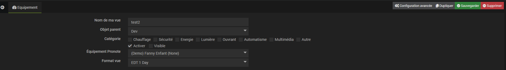
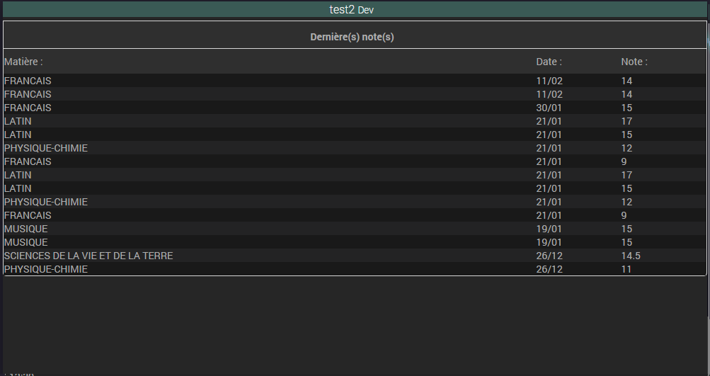
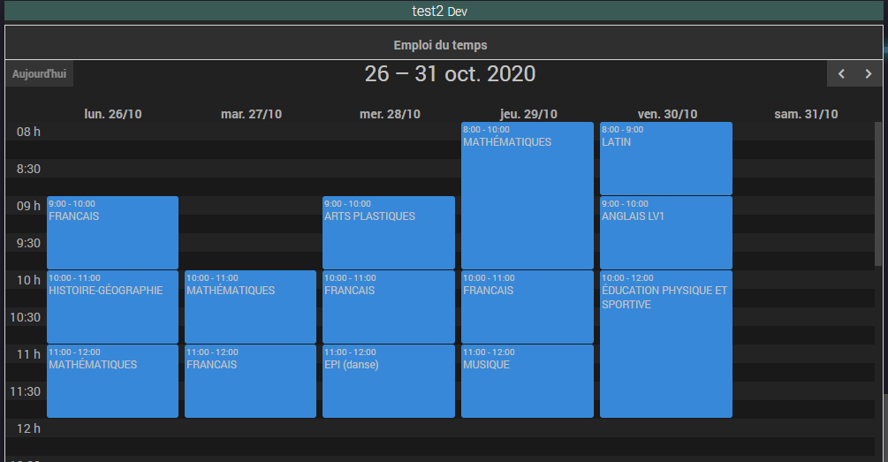

# Pronote View

## Présentation

Le plugin Pronote View permet d'afficher les graphiques de Pronote sur le Dashboard ainsi que dans les designs.

Page de Configuration : 

Exemple de graphique :

# Le plugin ne fonctionnera pas sans sa dependance principale qui est le plugin Pronote lui même
