# Pronote Link

## 1 ) Description

Le plugin Pronote Link permet de récupérer les informations provenant du site PRONOTE: 
 - Emploi du temps
 - Devoirs
 - Notes
 - Bulletins
 - Compétences
 - Absences
 
Pour cela, il faut avoir son accès a Pronote et/ou ENT.  

## 2 ) Paramètres obligatoires : 

### Ses Accès Pronote :

**Connaître son Académie:** 
Le plugin est compatible avec : 

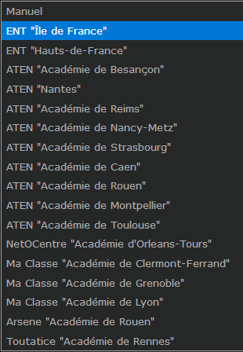

**Récupération de son URL :** 
 - Allez sur votre ENT, une fois connecté allez sur Pronote
  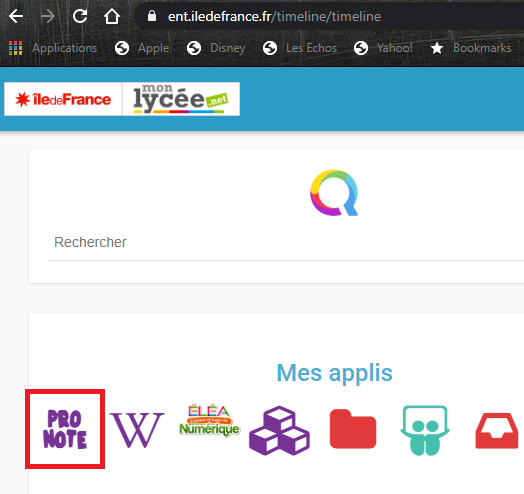

Récupérer votre Url : [https://091XXXxx.index-education.net/pronote/](https://0910727w.index-education.net/pronote/)

 

## 3) Configuration du Plugin
Après le téléchargement du plugin, il vous suffit de l’activer et de le configurer.

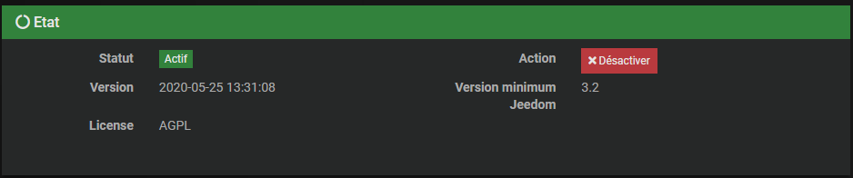
Une fois activé, il faut le configurer.

**3.1) Dépendances** 

Cette partie permet de valider et d’installer les dépendances requises au bon fonctionnement du plugin Pronote Link 

 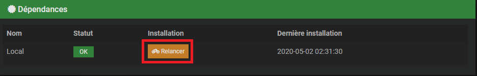
Cliquez sur "Relancer" et attendre la fin de l'installation des Dépendances.
Un Statut **OK** confirme que les dépendances sont satisfaites.
> **Tip**
> 
> La mise à jour des dépendances peut prendre plus de 20 minutes selon votre matériel. La progression est affichée en temps réel et un log **pronotelink_dep** est accessible.

> **Important**
> 
> La mise à jour des dépendances est normalement à effectuer seulement si le Statut est **NOK**, mais il est toutefois possible, pour régler certains problèmes, d’être appelé à refaire l’installation des dépendances.

**3.2) Démon**

 Cette partie permet de valider l’état actuel du ou des démons et de configurer la gestion automatique de ceux-ci.
 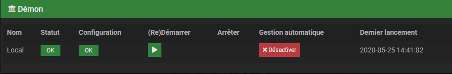
Le démon local et l’ensemble des démons déportés seront affichés avec leurs différentes informations.

-   Le **Statut** indique que le démon est actuellement en fonction.
    
-   La **Configuration** indique si la configuration du démon est valide.
    
-   Le bouton **(Re)Démarrer** permet de forcer le redémarrage du plugin, en mode normal ou de le lancer une première fois.
    
-   Le bouton **Arrête**, visible seulement si la gestion automatique est désactivée, force l’arrêt du démon.
    
-   La **Gestion automatique** permet à Jeedom de lancer automatiquement le démon au démarrage de Jeedom, ainsi que de le relancer en cas de problème.
    
-   Le **Dernier lancement** est comme son nom l’indique la date du dernier lancement connu du démon.

**3.4) Log**

Cette partie permet de choisir le niveau de log ainsi que d’en consulter le contenu.
  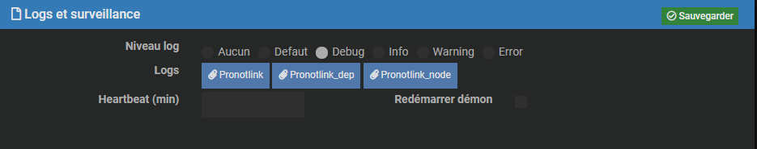
Sélectionnez le niveau puis sauvegardez, le démon sera alors relancé avec les instructions et traces sélectionnées.

Les niveaux **Debug** ou **Info** peuvent être utiles pour comprendre pourquoi le démon plante ou ne remonte pas une valeur.

> **Important**
> 
> En mode **Debug**, le démon est très verbeux, il est recommandé d’utiliser ce mode seulement si vous devez diagnostiquer un problème particulier. Il n’est pas recommandé de laisser tourner le démon en **Debug** en permanence si on utilise une **SD-Card**. Une fois le debug terminé, il ne faut pas oublier de retourner sur un niveau moins élevé comme le niveau **Error** qui ne remonte que d’éventuelles erreurs.

## 4) Configuration des équipements
La configuration des équipements Pronote Link est accessible à partir du menu plugin :

  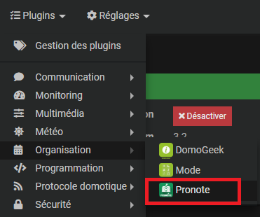

Ci-dessous un exemple d’une page du plugin Pronote Link (présentée avec quelques équipements) :

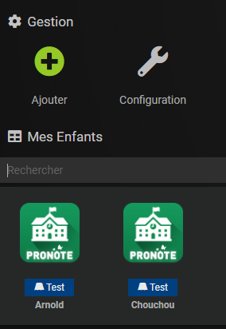

**4.1) Général**

Vous retrouvez ici toute la configuration de votre équipement :

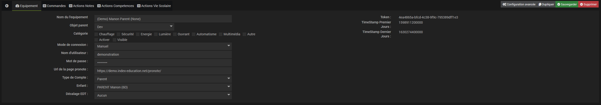

-   **Nom de l’équipement** : nom de votre équipement.
    
-   **Objet parent** : indique l’objet parent auquel appartient l’équipement.
    
-   **Catégorie** : les catégories de l’équipement (il peut appartenir à plusieurs catégories).
    
-   **Activer** : permet de rendre votre équipement actif.
    
-   **Visible** : le rend visible sur le dashboard.

-   **Mode de connexion** : Choisir son académie ou Manuel

-   **Nom d'utilisateur** : Login utilisé sur pronote.
    
-   **Mots de passe** : Mot de passe utilisé sur pronote

-  **Url de la page pronote** : Mettre l'Url récupéré au début de l'article .

-   **Type de Comptes** : Choisir le type de compte Eleve/Parent.

**4.2) Commandes**

**4.2.1) Commandes**
Ci-dessous, vous retrouvez la liste des commandes :

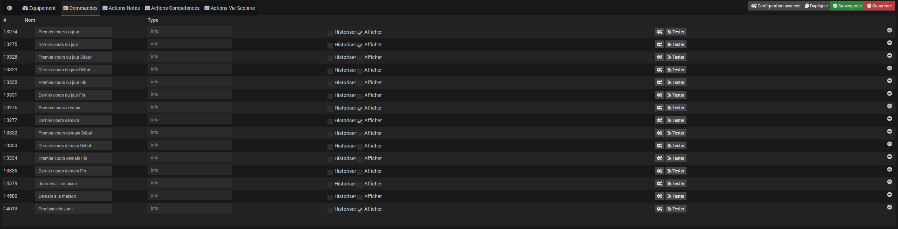

-   Dernière Note ( Message simple )

-   Dernière Absence ( Message lu par Discord )
    
-   Dernier Devoirs ( Message Personalisable )
    
-   Json API ( Envoyer une pièce jointe ou une photo de caméra ou une vidéo)

-   Last Succes Update ( Envoyer sur votre channel l'état des démons des plugins installés)

-   Last Success Error ( Envoyer sur votre channel l'état des dépendances des plugins installés)

Afficher : permet d’afficher la donnée sur le dashboard.

**4.2.2) Actions Notes**

**4.2.3) Actions Absence**

**4.2.4) Actions Devoirs**

**4.2.5) Actions EDT**

**4.2.6) Actions Bulletins**

## 5) Présentation du panel

Pour ce rendre sur le Panel
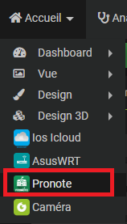

**5.1) l'accueil**

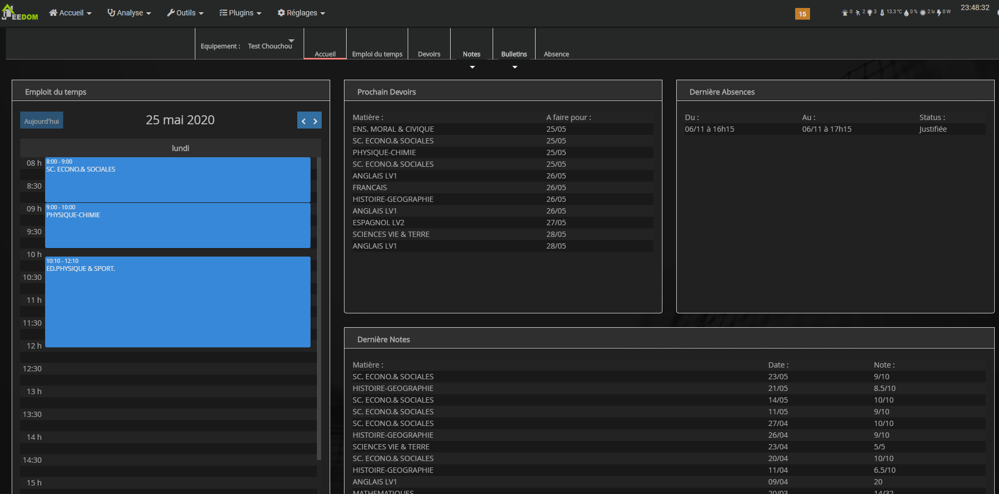

**5.2) Emploi du temps**

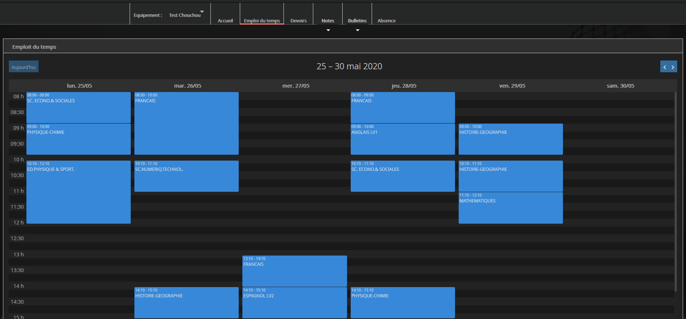

**5.3) Devoirs**

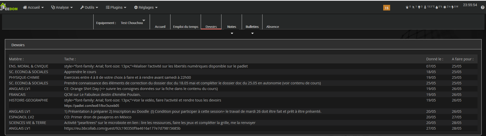

**5.4) Notes**

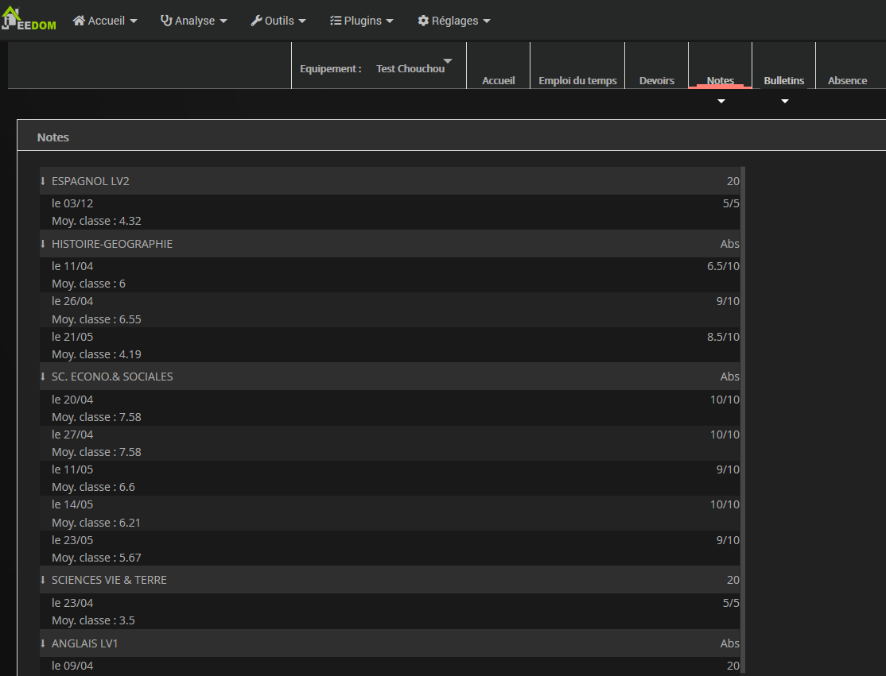

**5.5) Compétences**

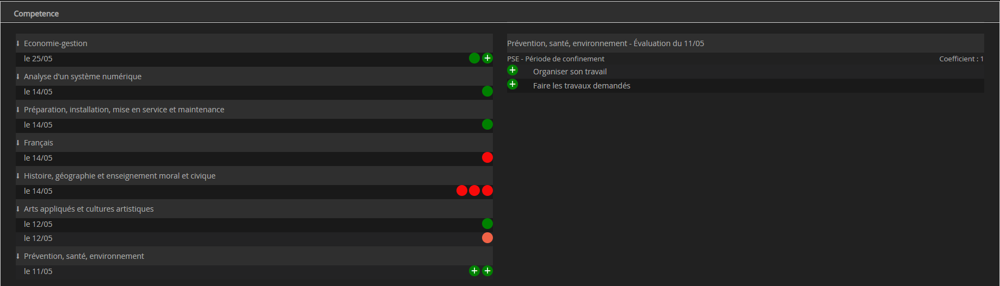

**5.6) Bulletins**

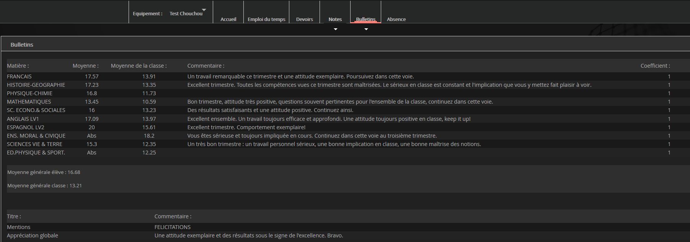

**5.7) Absence**

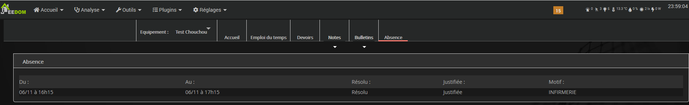

## 6) Utilisations dans un scénario

 
## 7) Astuces

## Faq
