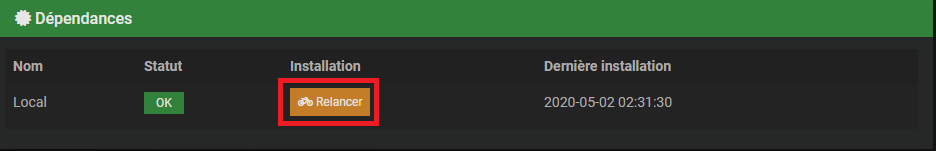
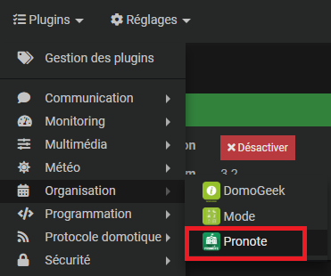
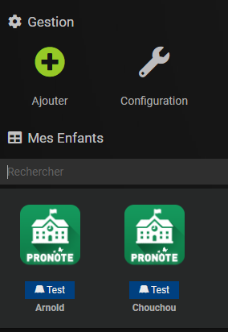
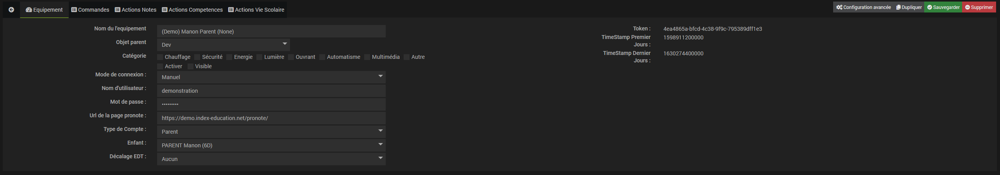
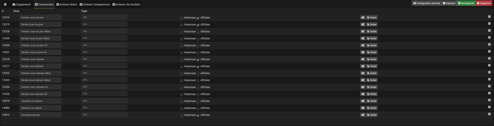
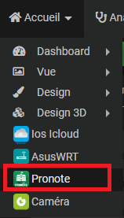
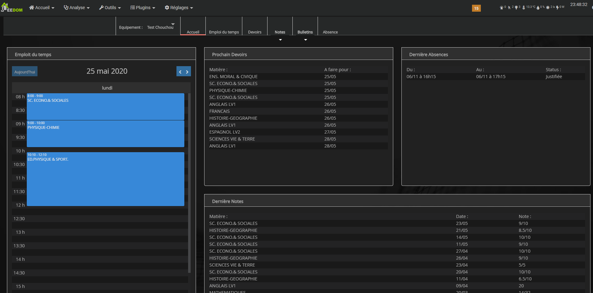
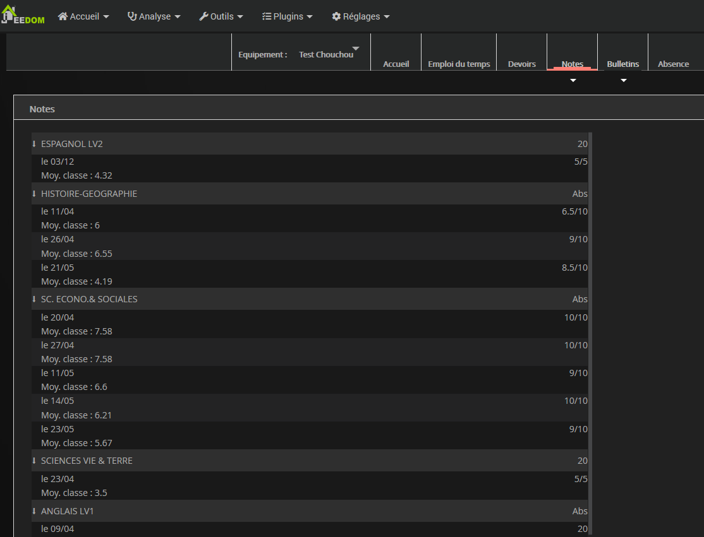
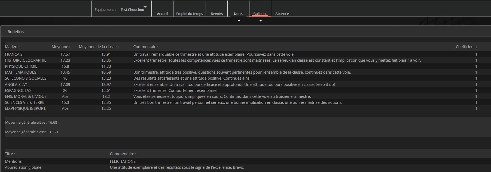

# Pronote Link

## 1 ) Description

Le plugin Pronote Link permet de récupérer les informations provenant du site PRONOTE: 
 - Emploi du temps
 - Devoirs
 - Notes
 - Bulletins de notes
 - Compétences
 - Absences
 
Pour cela, il faut avoir son accès à Pronote et/ou ENT.  

## 2 ) Paramètres obligatoires : 

### Ses accès Pronote :

**Connaître son Académie:** 
Le plugin est compatible avec : 

  **La Connexion directe (Manuel)**
  
  **Les ent suivantes :**

  
Les ent suivantes

  
    - Académie d'Orleans-Tours (URL : "ent.netocentre.fr")
    - Académie de Besançon (URL : "cas.eclat-bfc.fr")
    - Académie de Bordeaux (URL : "mon.lyceeconnecte.fr")
    - Académie de Bordeaux 2 (URL : "ent2d.ac-bordeaux.fr")
    - Académie de Caen (URL : "fip.itslearning.com")
    - Académie de Clermont-Ferrand (URL : "cas.ent.auvergnerhonealpes.fr")
    - Académie de Dijon (URL : "cas.eclat-bfc.fr")
    - Académie de Grenoble (URL : "cas.ent.auvergnerhonealpes.fr")
    - Académie de la Loire (URL : "cas.cybercolleges42.fr")
    - Académie de Lille (URL : "cas.savoirsnumeriques62.fr")
    - Académie de Lille (URL : "teleservices.ac-lille.fr")
    - Académie de Limoges (URL : "mon.lyceeconnecte.fr")
    - Académie de Lyon (URL : "cas.ent.auvergnerhonealpes.fr)
    - Académie de Marseille (URL : "atrium-sud.fr")
    - Académie de Montpellier (URL : "cas.mon-ent-occitanie.fr")
    - Académie de Nancy-Metz (URL : "cas.monbureaunumerique.fr")
    - Académie de Nantes (URL : "cas3.e-lyco.fr")
    - Académie de Poitiers (URL : "mon.lyceeconnecte.fr")
    - Académie de Reims (URL : "cas.monbureaunumerique.fr")
    - Académie de Rouen (Arsene76) (URL : "cas.arsene76.fr")
    - Académie de Rouen (URL : "nero.l-educdenormandie.fr")
    - Académie de Strasbourg (URL : "cas.monbureaunumerique.fr")
    - Académie de Toulouse (URL : "cas.mon-ent-occitanie.fr")
    - Académie du Val-d'Oise (URL : "cas.moncollege.valdoise.fr")
    - ENT "Agora 06" (Nice) (URL : "cas.agora06.fr")
    - ENT "Haute-Garonne" (URL : "cas.ecollege.haute-garonne.fr")
    - ENT "Hauts-de-France" (URL : "enthdf.fr")
    - ENT "La Classe" (Lyon) (URL : "www.laclasse.com")
    - ENT "Lycee Connecte" (Nouvelle-Aquitaine) (URL : "mon.lyceeconnecte.fr")
    - ENT "Seine-et-Marne" (URL : "ent77.seine-et-marne.fr")
    - ENT "Somme" (URL : "college.entsomme.fr")
    - ENT "Portail Famille" (Orleans Tours) (URL : "seshat.ac-orleans-tours.fr:8443")
    - ENT "Toutatice" (Rennes) (URL : "www.toutatice.fr")
    - ENT "Île de France" (URL : "ent.iledefrance.fr")
    - ENT "Paris Classe Numerique" (URL : "ent.parisclassenumerique.fr")
    - ENT "Lycee Jean Renoir Munich" (URL : "cas.kosmoseducation.com")
    - ENT "L'Eure en Normandie" (URL : "cas.ent27.fr")  

**Récupération de son URL :** 
 - Allez sur votre ENT, une fois connecté allez sur Pronote
  

Récupérez votre Url : [https://XXXXXXxx.index-education.net/pronote/](https://XXXXXXXX.index-education.net/pronote/)
 

## 3) Configuration du plugin
Après le téléchargement du plugin, il vous suffit de l’activer et de le configurer.

Une fois activé, il faut le configurer.

**3.1) Dépendances** 

Cette partie permet de valider et d’installer les dépendances requises au bon fonctionnement du plugin Pronote Link 

 
Cliquez sur "Relancer" et attendre la fin de l'installation des dépendances.
Un Statut **OK** confirme que les dépendances sont satisfaites.
> **Tip**
> 
> La mise à jour des dépendances peut prendre plus de 20 minutes selon votre matériel. La progression est affichée en temps réel et un log **pronotelink_dep** est accessible.

> **Important**
> 
> La mise à jour des dépendances est normalement à effectuer seulement si le Statut est **NOK**, mais il est toutefois possible, pour régler certains problèmes, d’être appelé à refaire l’installation des dépendances.

**3.2) Démon**

 Cette partie permet de valider l’état actuel du ou des démons et de configurer la gestion automatique de ceux-ci.
 
Le démon local et l’ensemble des démons déportés seront affichés avec leurs différentes informations.

-   Le **Statut** indique que le démon est actuellement en fonction.
    
-   La **Configuration** indique si la configuration du démon est valide.
    
-   Le bouton **(Re)Démarrer** permet de forcer le redémarrage du plugin, en mode normal ou de le lancer une première fois.
    
-   Le bouton **Arrête**, visible seulement si la gestion automatique est désactivée, force l’arrêt du démon.
    
-   La **Gestion automatique** permet à Jeedom de lancer automatiquement le démon au démarrage de Jeedom, ainsi que de le relancer en cas de problème.
    
-   Le **Dernier lancement** est comme son nom l’indique la date du dernier lancement connu du démon.

**3.4) Log**

Cette partie permet de choisir le niveau de log ainsi que d’en consulter le contenu.
  
Sélectionnez le niveau puis sauvegardez, le démon sera alors relancé avec les instructions et traces sélectionnées.

Les niveaux **Debug** ou **Info** peuvent être utiles pour comprendre pourquoi le démon plante ou ne remonte pas une valeur.

> **Important**
> 
> En mode **Debug**, le démon est très verbeux, il est recommandé d’utiliser ce mode seulement si vous devez diagnostiquer un problème particulier. Il n’est pas recommandé de laisser tourner le démon en **Debug** en permanence si on utilise une **SD-Card**. Une fois le debug terminé, il ne faut pas oublier de retourner sur un niveau moins élevé comme le niveau **Error** qui ne remonte que d’éventuelles erreurs.

**3.5) Panel**

Important pronote utilise le panel pour afficher les informations, il est donc important de cocher la case.

 

## 4) Configuration des équipements
La configuration des équipements Pronote Link est accessible à partir du menu plugin :

  

Ci-dessous un exemple d’une page du plugin Pronote Link (présentée avec quelques équipements) :

**4.1) Général**

Vous retrouvez ici toute la configuration de votre équipement :

-   **Nom de l’équipement** : nom de votre équipement.
    
-   **Objet parent** : indique l’objet parent auquel appartient l’équipement.
    
-   **Catégorie** : les catégories de l’équipement (il peut appartenir à plusieurs catégories).
    
-   **Activer** : permet de rendre votre équipement actif.
    
-   **Visible** : le rend visible sur le dashboard.

-   **Mode de connexion** : Choisir son académie ou Manuel

-   **Nom d'utilisateur** : Login utilisé sur Pronote.
    
-   **Mots de passe** : Mot de passe utilisé sur Pronote

-  **Url de la page pronote** : Mettre l'Url récupérée au début de l'article .

-   **Type de Comptes** : Choisir le type de compte Eleve/Parent.

-   **Enfant** : Permet de choisir l'enfant

-   **Décalage EDT** : Permet de décaler l'emploi du temps pour correspondre au bon horaire 

**4.2) Commandes**

**4.2.1) Commandes**

Ci-dessous, vous retrouvez la liste des commandes :

-   Premier cours du jour

-   Dernier cours du jour

-   Premier cours du jour Début

-   Dernier cours du jour Début

-   Premier cours du jour Fin

-   Dernier cours du jour Fin

-   Premier cours demain

-   Dernier cours demain

-   Premier cours demain Début

-   Dernier cours demain Début

-   Premier cours demain Fin

-   Dernier cours demain Fin

-   Journée à la maison

-   Demain à la maison

-   Prochains devoirs (Encodage HTML)

**4.2.2) Actions Notes**

Le button tester les actions permet de test les execution avec une note fictive

Si exécuter dans un scenario, ca lance le scenario avec les tag suivant: 
- `timestamp` : Timestamp de la note
- `date` : Date de la note (Literal)
- `title` : Nom de la note
- `subject` : Sujet de la competence
- `minClasse` : Note minimum de la classe
- `maxClasse` : Note maximum de la classe
- `moyenne` : Moyen de la classe
- `note` : Note de l'élèves
- `max` : Indique la note maximum possible d'atteindre
- `coef` : coefficient de la competence
- `equip` : Id de l'équipement

**4.2.3) Actions Vie Scolaire**

Les button tester les actions permet de tester les event via des event fictif.

**4.2.3.1) Les tags Absences**

- `from` : Date de debuts (Literal)
- `to` : Date de Fin (Literal)
- `hours` : Temps en heure de l'absence
- `reason` : Reason
- `solved` : Si résolue
- `justified` : Si justifiée
- `equip` : Id de l'équipement
- `isedit` : Valeur permettant de savoir si c'est une edition ou pas

**4.2.3.2) Les tags Retards**
- `date` : Date de la punition (Literal)
- `justified` : Si justifiée
- `solved` : Si résolue
- `justification` : Justification du retard
- `minutesMissed` : Temps de cours rater (En Minutes)
- `reason` : Reason
- `isedit` : Valeur permettant de savoir si c'est une edition ou pas

**4.2.3.3) Les tags Punitions**
- `date` : Date de la punition (Literal)
- `isExclusion` : Si c'est une exclusion
- `isDuringLesson` : Si c'est pendant une lesson
- `homework` : devoirs a faire pendant
- `circumstances` : Circonstance de la punition
- `giver` : Personnel qui l'a donner
- `reason` : Reason de la punition
- `detentionFrom` : Punition debuts
- `detentionTo` : Punition fin
- `isedit` : Valeur permettant de savoir si c'est une edition ou pas

**4.2.3.4) Les tags Autres**
- `date` : Date de la punition (Literal)
- `kind` : Nom
- `giver` : Personnel qui l'a donner
- `comment` : Commentaire
- `subject` : Sujet
- `isedit` : Valeur permettant de savoir si c'est une edition ou pas

**4.2.2) Actions Competence**

Le button tester les actions permet de test les execution avec une competence fictive

Si exécuter dans un scenario, ca lance le scenario avec les tags suivant : 
- `timestamp` : Timestamp de la competence
- `date` : Date de la competence (Literal)
- `name` : Nom de la competence
- `subject` : Sujet de la competence
- `long` : long text
- `short` : cours text
- `coef` : coefficient de la competence
- `equip` : Id de l'équipement

## 5) Présentation du panel

Pour se rendre sur le panel

**5.1) l'accueil**

**5.2) Emploi du temps**

**5.3) Devoirs**

**5.4) Notes**

**5.5) Compétences**

**5.6) Bulletins**

**5.7) Absence**

## 6) Utilisations dans un scénario

Proposée vos scenarios pour les partager.

 
## 7) Astuces

## Faq
